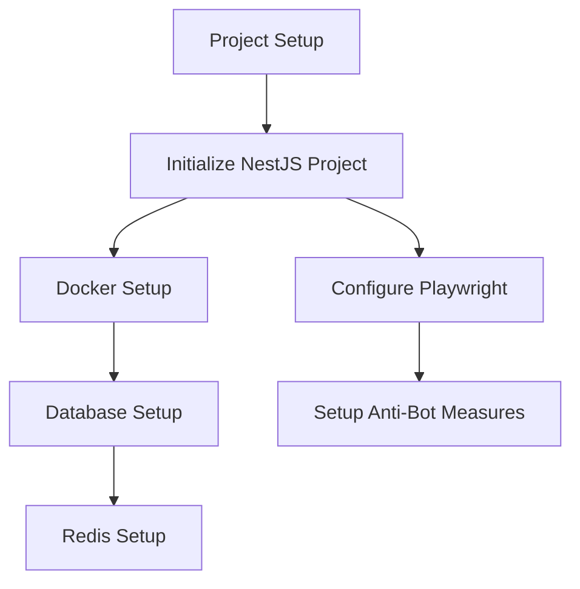
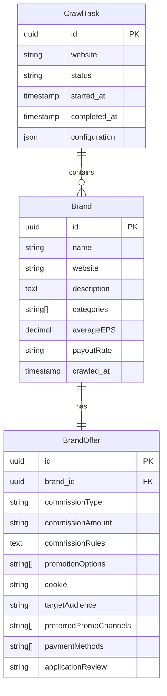
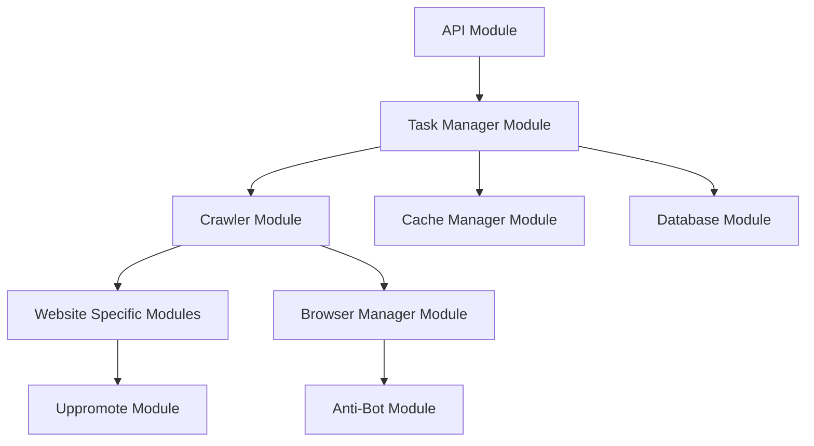

# Implementation Plan for Crawling API Server

## 1. Project Setup & Infrastructure

### 1.1 Project Initialization
- Create NestJS project with TypeScript
- Configure project structure following modular architecture
- Setup development tools (ESLint, Prettier, etc.)

### 1.2 Docker Environment
- Create Dockerfile for the application
- Setup docker-compose.yml with services:
  - API server
  - PostgreSQL
  - Redis
  - Proxy service (for proxy support)

### 1.3 Database Design

## 2. Core Modules Architecture

### 2.1 Module Responsibilities
1. **API Module**
   - Handle HTTP requests
   - Input validation
   - Response formatting
   - API documentation (Swagger)

2. **Task Manager Module**
   - Task creation and scheduling
   - Status tracking
   - Progress monitoring
   - Cache management coordination

3. **Crawler Module**
   - Base crawler functionality
   - Common utilities
   - Error handling
   - Retry mechanisms

4. **Website Specific Modules**
   - Implement site-specific logic
   - XPath selectors management
   - Data extraction rules
   - Navigation patterns

5. **Browser Manager Module**
   - Playwright configuration
   - Browser profile management
   - Proxy rotation
   - Session management

6. **Anti-Bot Module**
   - Stealth plugin configuration
   - Fingerprint generation
   - Detection evasion strategies

## 3. Implementation Phases

### Phase 1: Foundation Setup
1. Project initialization
2. Docker environment setup
3. Database and Redis configuration
4. Basic API endpoints

### Phase 2: Core Functionality
1. Browser automation setup
2. Anti-bot measures implementation
3. Base crawler functionality
4. Task management system

### Phase 3: Uppromote Crawler Implementation
1. Login flow
2. Navigation and pagination
3. Data extraction
4. Error handling and retries

### Phase 4: Advanced Features
1. Caching system
2. Proxy support
3. Local browser profile integration
4. Performance optimizations

### Phase 5: Testing & Documentation
1. Unit tests
2. Integration tests
3. API documentation
4. Deployment guide

## 4. Technical Considerations

### 4.1 Error Handling Strategy
- Implement retry mechanisms for network failures
- Handle anti-bot detection gracefully
- Log detailed error information
- Maintain task status accuracy

### 4.2 Performance Optimization
- Implement connection pooling for database
- Use Redis for caching frequently accessed data
- Optimize browser resource usage
- Implement efficient data batching

### 4.3 Security Measures
- Secure credential storage
- Rate limiting
- Input validation
- Access control

### 4.4 Monitoring & Logging
- Implement comprehensive logging
- Setup monitoring for:
  - Crawler performance
  - Resource usage
  - Error rates
  - Success rates