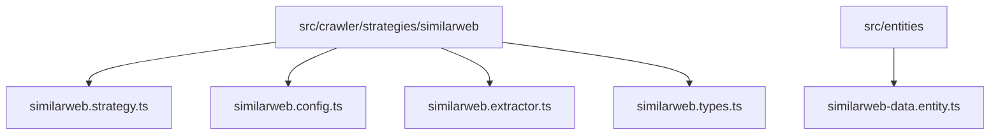

# Similarweb Crawler Implementation Plan

## 1. Project Structure


## 2. Implementation Components

### A. Configuration (similarweb.config.ts)
```typescript
export const similarwebConfig: WebsiteConfig = {
  name: 'Similarweb',
  type: 'similarweb',
  version: '1.0.0',
  baseUrl: 'https://www.similarweb.com',
  endpoints: {
    initPage: '/website/{domain}/#overview'
  },
  selectors: {
    data: {
      globalRank: '::-p-xpath(//*[@id="overview"]/div/div/div/div[3]/div/div[1]/div/p)',
      totalVisits: '::-p-xpath(//*[@id="overview"]/div/div/div/div[4]/div[2]/div[1]/p[2])',
      bounceRate: '::-p-xpath(//*[@id="overview"]/div/div/div/div[4]/div[2]/div[2]/p[2])',
      pagesPerVisit: '::-p-xpath(//*[@id="overview"]/div/div/div/div[4]/div[2]/div[3]/p[2])',
      avgVisitDuration: '::-p-xpath(//*[@id="overview"]/div/div/div/div[4]/div[2]/div[4]/p[2])',
      organicSearch: 'section#traffic-sources div[id^="highcharts"] g:nth-child(3) tspan',
      paidSearch: 'section#traffic-sources div[id^="highcharts"] g:nth-child(4) tspan',
      topKeywords: 'section#keywords div.wa-vectors-list__items span.wa-vectors-list__item-title',
      topCountries: 'section#geography div.wa-geography__legend-item div.wa-geography__country-info a.wa-geography__country-name',
      trafficDemographics: 'section#demographics div.app-section__container'
    }
  },
  authentication: {
    type: 'none'
  }
};
```

### B. Strategy Implementation (similarweb.strategy.ts)
```typescript
@Injectable()
export class SimilarwebStrategy extends BaseCrawlerStrategy {
  constructor(
    @InjectRepository(SimilarwebData)
    private readonly dataRepository: Repository<SimilarwebData>,
    private readonly apiService: ApiService
  ) {
    super(similarwebConfig);
  }

  async login(): Promise<void> {
    // No login required
  }

  async extractData(page: Page, taskId: string): Promise<Record<string, any>[]> {
    // Implementation of data extraction using selectors from config
  }

  protected async validateWebsiteSpecificConfig(): Promise<void> {
    // Validate similarweb specific configuration
  }

  protected async handleNavigation(page: Page): Promise<void> {
    // Handle any specific navigation requirements
  }
}
```

### C. Entity (similarweb-data.entity.ts)
```typescript
@Entity()
export class SimilarwebData {
  @PrimaryGeneratedColumn('uuid')
  id: string;

  @Column()
  url: string;

  @Column('float', { nullable: true })
  globalRank: number;

  @Column('float', { nullable: true })
  totalVisits: number;

  @Column('float', { nullable: true })
  bounceRate: number;

  @Column('float', { nullable: true })
  pagesPerVisit: number;

  @Column({ nullable: true })
  avgVisitDuration: string;

  @Column('float', { nullable: true })
  organicSearch: number;

  @Column('float', { nullable: true })
  paidSearch: number;

  @Column('simple-array', { nullable: true })
  topKeywords: string[];

  @Column('simple-array', { nullable: true })
  topCountries: string[];

  @Column('text', { nullable: true })
  trafficDemographicsScreenshot: string;

  @Column()
  taskId: string;

  @CreateDateColumn()
  createdAt: Date;

  @UpdateDateColumn()
  updatedAt: Date;
}
```

## 3. Integration Steps

1. Register Strategy:
```typescript
// In CrawlerService
private initializeStrategies(): void {
  // Existing strategies...
  
  const similarwebStrategy = new SimilarwebStrategy(
    this.similarwebDataRepository,
    this.apiService
  );
  this.strategies.set('similarweb', similarwebStrategy);
  this.logger.debug('Similarweb strategy initialized');
}
```

2. Update Database Schema:
```typescript
// In app.module.ts
TypeOrmModule.forFeature([
  // Existing entities...
  SimilarwebData
])
```

## 4. Usage Example

```typescript
// Run task
POST /tasks
{
  "url": "https://example.com",
  "websiteType": "similarweb",
  "proxy": {
    "server": "proxy.example.com:8080",
    "username": "user",
    "password": "pass"
  }
}

// Check status
GET /tasks/{taskId}
```

## 5. Technical Considerations

1. Anti-Bot Detection:
- Use playwright-extra with stealth plugin
- Implement random delays between actions
- Rotate user agents
- Support proxy configuration

2. Error Handling:
- Implement retries for network failures
- Handle anti-bot detection scenarios
- Validate input URLs
- Handle rate limiting with exponential backoff

3. Performance:
- Cache results in Redis
- Implement connection pooling
- Use efficient selectors
- Optimize screenshot capture

4. Monitoring:
- Log all crawling activities
- Track success/failure rates
- Monitor resource usage
- Alert on failures

## 6. Testing Strategy

1. Unit Tests:
- Test URL parsing
- Test data transformation
- Test configuration validation
- Test error handling

2. Integration Tests:
- Test strategy registration
- Test database operations
- Test proxy configuration
- Test task lifecycle

3. E2E Tests:
- Test complete crawling flow
- Test error scenarios
- Test rate limiting
- Test proxy functionality

## 7. Deployment Considerations

1. Environment Variables:
```env
SIMILARWEB_RATE_LIMIT=100
SIMILARWEB_TIMEOUT=30000
SIMILARWEB_RETRY_ATTEMPTS=3
SIMILARWEB_RETRY_DELAY=1000
```

2. Dependencies:
```json
{
  "playwright-extra": "^4.0.0",
  "fingerprint-injector": "^2.0.0"
}
```

3. Database Migrations:
- Create migration for SimilarwebData entity
- Add indexes for frequent queries
- Set up proper constraints

4. Monitoring Setup:
- Configure error alerting
- Set up performance monitoring
- Implement health checks